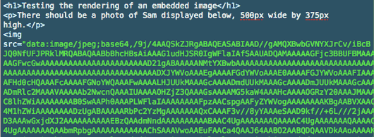
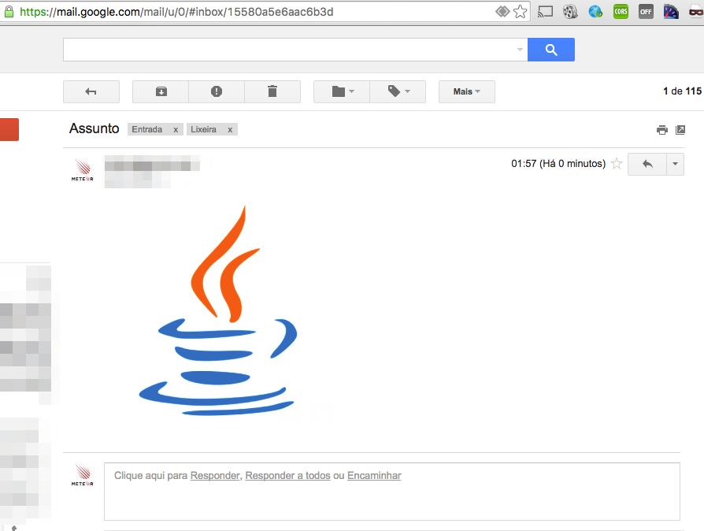
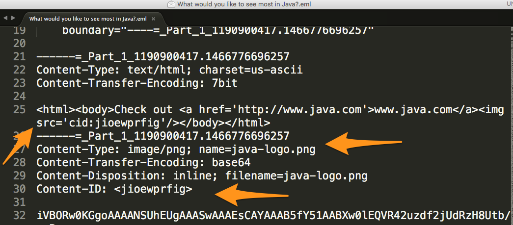
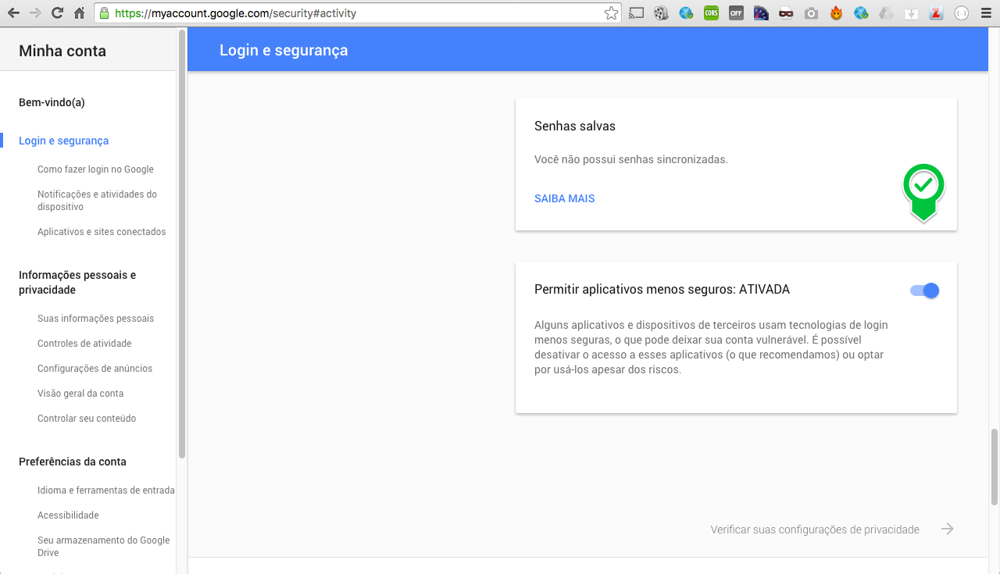

# Java Send Mailer

Java Tool for Sending EMail with CID attachment.

CID : Content-ID as embedded image.




## Prerequires

1. Git 2.6+
2. Maven 3.3+
3. Java 8+


## How to Play

Clone

```
git clone https://github.com/humbertodias/java-send-email-cid-attachment.git
```

Inside the folder

```
cd java-send-email-cid-attachment
```

**Package**

```
mvn clean package
```

**Send**

```
java -jar target/sendemail.jar \
-from from@gmail.com \
-to mail1@gmail.com,mail2@yahoo.com.br \
-replyto noreply@gmail.com \
-subject "What would you like to see most in Java?" \
-smtp.host smtp.gmail.com \
-smtp.port 587  \
-html "<html><body>Check out <a href='http://www.java.com'>www.java.com</a></body></html>" \
-attachs doc/java-logo.png \
-user $USERNAME \
-password

```

**Arguments**

Parameter | Description
------------- | -------------
-from | From Address
-to | To Address
-replyto | Reply To Address
-cc | (Carbon Copy) - Email address(es) here if you are sending a copy for their information (and you want everyone to explicitly see this)
-bcc | (Blind Carbon Copy) - Email address here if you are sending them a Copy and you do not want the other recipients to see that you sent it to this contact
-subject |  Subject
-smtp.host | SMTP Host
-smtp.port | SMTP Port
-html | HTML Message
-attachs | Attachment
-user | User
-password | Password

## Output

```
mvn clean package
[INFO] Scanning for projects...
[INFO]                                                                         
[INFO] ------------------------------------------------------------------------
[INFO] Building java-send-mail 0.0.1-SNAPSHOT
[INFO] ------------------------------------------------------------------------
[INFO] Copying 0 resource
[INFO] 
[INFO] --- maven-compiler-plugin:3.1:compile (default-compile) @ send-mail ---
[INFO] 
[INFO] --- maven-jar-plugin:2.4:jar (default-jar) @ send-mail ---
[INFO] Building jar: /Users/humbertodias/git/java-send-mailer/target/send-mail-0.0.1-SNAPSHOT.jar
[INFO] 
[INFO] --- maven-dependency-plugin:2.8:copy-dependencies (default) @ send-mail ---
[INFO] Copying commons-logging-1.2.jar to /Users/humbertodias/git/java-send-mailer/target/send-mail-0.0.1-SNAPSHOT.lib/commons-logging-1.2.jar
[INFO] Copying commons-email-1.4.jar to /Users/humbertodias/git/java-send-mailer/target/send-mail-0.0.1-SNAPSHOT.lib/commons-email-1.4.jar
[INFO] Copying javax.mail-1.5.2.jar to /Users/humbertodias/git/java-send-mailer/target/send-mail-0.0.1-SNAPSHOT.lib/javax.mail-1.5.2.jar
[INFO] Copying activation-1.1.1.jar to /Users/humbertodias/git/java-send-mailer/target/send-mail-0.0.1-SNAPSHOT.lib/activation-1.1.1.jar
[INFO] Copying jcommander-1.48.jar to /Users/humbertodias/git/java-send-mailer/target/send-mail-0.0.1-SNAPSHOT.lib/jcommander-1.48.jar
[INFO] ------------------------------------------------------------------------
[INFO] BUILD SUCCESS
[INFO] ------------------------------------------------------------------------
[INFO] Total time: 3.151 s
[INFO] Finished at: 2016-06-24T02:01:12-03:00
[INFO] Final Memory: 18M/215M
[INFO] ------------------------------------------------------------------------

```

## Inbox



## Raw Message




## Solutions

If you recieve the follow exception:

```
Caused by: javax.mail.AuthenticationFailedException: 534-5.7.14 <https://accounts.google.com/signin/continue?sarp=1&scc=1&plt=AKgnsbs5
534-5.7.14 3133xNorQuATjuGGVsL8hogCto3wUsOueoL7gBxaoblHfsLiw27IIfGGcGeqvYkhsiIPM7
534-5.7.14 7UlBiL4WPDaeGO_fJYtgPGSeuA7jKhCi7snTGFUNwWRmStPABxp-3dgguOAjIloa041WPD
534-5.7.14 wWvfgYPIU7STlxKCY0zeUY1eG-6rnjDBHviTX1GQ_9JomG2-bWadOaEUQmWNG7dIPI9AN6
534-5.7.14 0athdCkIzGqQwH3Gon5gXYcTV1HB0> Please log in via your web browser and
534-5.7.14 then try again.
534-5.7.14  Learn more at
534 5.7.14  https://support.google.com/mail/answer/78754 111sm1297176uav.0 - gsmtp
```

Access your account on [https://www.google.com/settings/security/lesssecureapps](https://www.google.com/settings/security/lesssecureapps) and enable **access to lesse secure apps**.



1. [GMail Less Security](https://support.google.com/accounts/answer/6010255?hl=en)


## References

1. [https://en.wikipedia.org/wiki/MIME](https://en.wikipedia.org/wiki/MIME)

2. [https://www.campaignmonitor.com/blog/how-to/2008/08/embedding-images-in-email/](https://www.campaignmonitor.com/blog/how-to/2008/08/embedding-images-in-email/)
