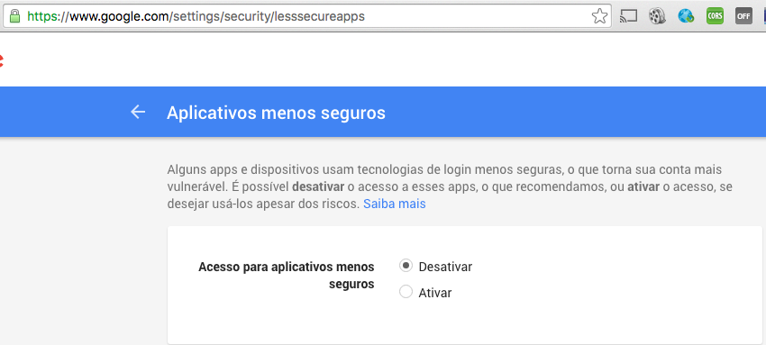

# Java Send Mailer

Java Tools for generating QRCode.


## Prerequires

1. Git 2.6+
2. Maven 3.3+
3. Java 8+


## How to Play

Clone

```
git clone https://github.com/humbertodias/java-send-mailer.git
```

Inside the folder

```
cd java-send-mailer
```

**Package**

```
mvn clean package
```

**Send**

```
java -jar target/send-mail-0.0.1-SNAPSHOT.jar \
-from from@gmail.com \
-to mail1@gmail.com,mail2@yahoo.com.br \
-replyto noreply@gmail.com \
-subject SUBJECT \
-smtp.host smtp.gmail.com \
-smtp.port 587  \
-html "<html><body></body></html>" \
-attachs doc/java-logo.png \
-user USERNAME \
-password

```

**Arguments**

Parameter | Description
------------- | -------------
-from | From Address
-to | To Address
-replyto | Reply To Address
-subject |  Subject
-smtp.host | SMTP Host
-smtp.port | SMTP Port
-html | HTML Message
-attachs | Attachment
-user | User
-password | Password

## Output


## Recieved


## References



1. [GMail Less Security](https://support.google.com/accounts/answer/6010255?hl=en)

